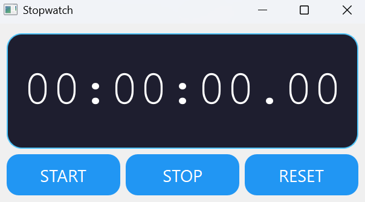

# ⏱️ PyQt5 Stopwatch

A sleek, functional stopwatch built using Python and the **PyQt5** GUI framework. This desktop application features a real-time timer with Start, Stop, and Reset functionality, styled with a modern UI.

---

## 🎯 Features

- Start, Stop, and Reset buttons
- Time displayed in `HH:MM:SS.ms` format (with 10ms precision)
- Responsive PyQt5 GUI layout
- Modern custom stylesheet with hover and pressed effects

---

## 🖥️ Demo

>   


---

## 🛠️ Installation

### 1. Clone the Repository

```
git clone https://github.com/KanchanP333/Stopwatch.git
cd Stopwatch
```

### 2. Install dependencies

```
pip install PyQt5
```

### 3. Run the app

```
python main.py
```

---

## Controls

- START: Begin timing
- STOP: Pause the timer (can be resumed with START)
- RESET: Stop the timer and reset to 00:00:00.00

---

## Customization
You can easily customize the appearance by modifying the setStyleSheet() section in the initUI() method:

- Change colors by modifying the hex color codes
- Adjust font sizes and families
- Modify padding and border radius values
- Update button hover and pressed states
